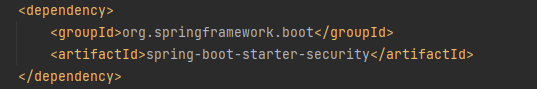
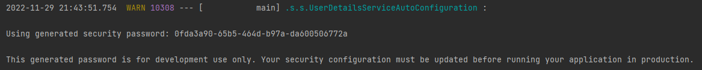
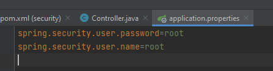

# Spring Security

Spring Security — это фреймворк, который фокусируется на предоставлении как аутентификации, так и авторизации в приложениях Java. Как и во всех проектах Spring, реальная сила Spring Security заключается в том, как легко ее можно расширить для удовлетворения пользовательских требований.

Самый простой способ начать использовать Сервер авторизации Spring — создать приложение на основеSpring Boot. Можно использовать start.spring.io для создания базового проекта

Если мы явно не задаем пароль, то Spring генерирует его автоматически:
По умолчанию создает пользователя User

второй способ идентификации, через properties:

При запуске Spring создает две страницы:

1) login

2) logout

Способ авторизации:

